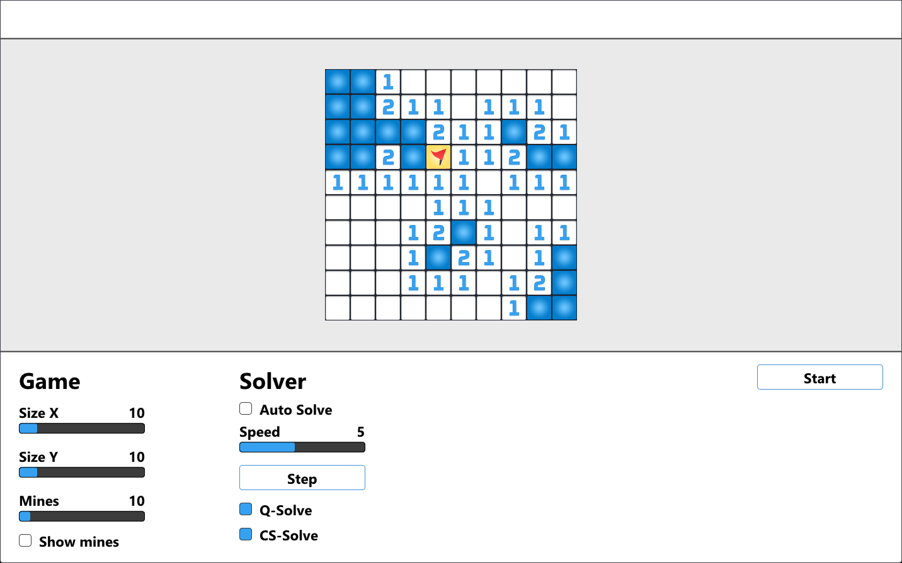

# Milkshake

This is a Minesweeper solver project called Milkshake which I have written quite some time ago for a competition. It uses Dear ImGui and DirectX 11.

It has two algorithms, Q-Solve and CS-Solve, with no probability, endgame evaluation, or anything elaborate.

## License

[MIT](LICENSE)
